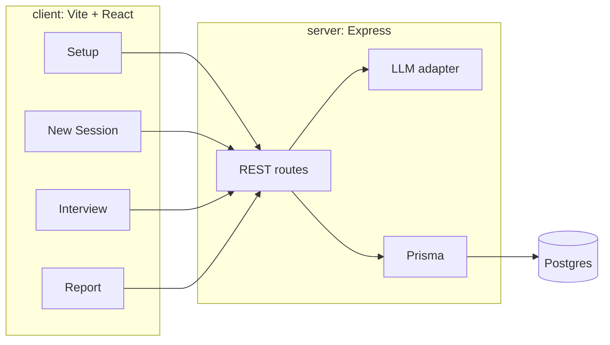
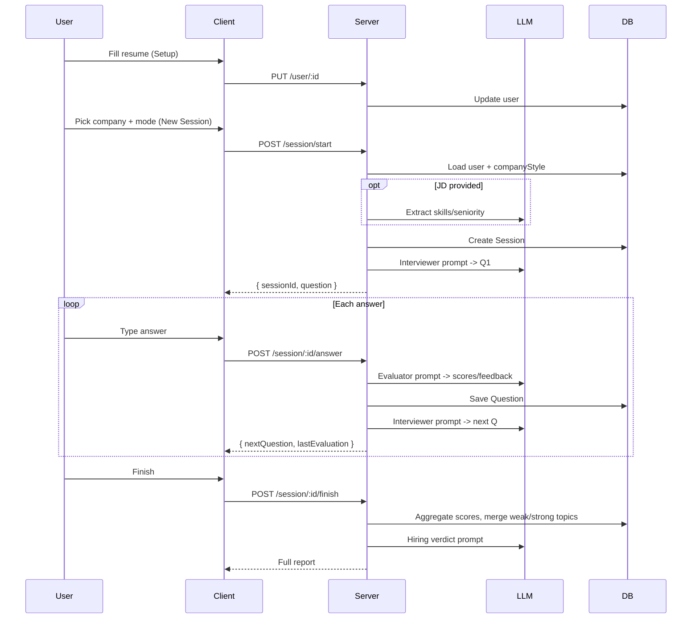

# 01 — Architecture

## Overview

Two-part app: a Vite/React client talking over REST to an Express server, which uses Prisma to
persist to Postgres and calls a single OpenAI-compatible LLM endpoint for interviewing, evaluating,
and producing a final hiring verdict.

## Core Loop

## Design Decisions

- **OpenAI-compatible adapter.** One `fetch` wrapper hitting `${LLM_BASE_URL}/chat/completions`.
  Swap OpenAI/Groq by changing `LLM_BASE_URL` + `LLM_MODEL` + `LLM_API_KEY`. No code fork.
- **Single hardcoded user.** Seeded with a fixed UUID from `HARDCODED_USER_ID`. Client reads the
  same id from `VITE_USER_ID`. No auth layer.
- **User-driven session length.** The interview continues while the user answers; there is no fixed
  question count. The user clicks "Finish" to end and generate the report.
- **Company styles are data, not code.** Adding a new company = one DB insert (see seed).
- **JSON-mode LLM calls.** Evaluator and Verdict prompts request strict JSON; the adapter parses
  and tolerates accidental markdown fences.
