# 02 — Interview Brain Consolidation (Architecture Proposal)

> **Status:** IMPLEMENTING — M1–M4 wired behind `INTELLIGENCE_BRAIN=true`.  
> **Principle:** A logical agent is a cognitive responsibility. An LLM call is network latency. Separate them.  
> **Goal:** Preserve all V2 reasoning quality while cutting LLM invocations ~70–80%.  
> **Supersedes (as preferred path):** incremental call-shaving in [01-v2-llm-budget-and-latency.md](01-v2-llm-budget-and-latency.md). Keep that doc for metrics/baselines.  
> **Product follow-on:** What the Brain should teach across a lifetime → [03-lifelong-role-curriculum.md](03-lifelong-role-curriculum.md).

---

## 0. Decision summary (for approval)

| Question | Proposal |
|----------|----------|
| Delete agents? | **No.** Keep Resume Analyst, Tech/Comm evaluators, Misconception, Director, Planner, Generator, Report Writer as **logical modules**. |
| How do they run? | Most answer-turn modules execute as **sections inside one Interview Brain prompt** → one Groq call. |
| Who owns memory? | **Server only.** Brain receives compact context; returns structured updates; Evidence Engine / CCM / Hypothesis Engine / Concept Graph persist on the backend. |
| Feature flag? | New `INTELLIGENCE_BRAIN=true` (or mode `v2-brain`) beside existing `INTELLIGENCE_V2`. Multi-call V2 remains fallback. |
| Implement now? | **In progress** — enable with `INTELLIGENCE_V2=true` + `INTELLIGENCE_BRAIN=true`. |

---

## 1. Architecture comparison — Current vs Optimized

### Current V2 (Phases 1–7 shipped)

```
Logical Agent  ≈  LLM Call
```

| Stage | Physical Groq calls (typical) |
|-------|-------------------------------|
| Start | Resume Analyst + Director + Generator ≈ **3** (+ JD/curriculum shared) |
| Each answer | Tech + Comm + V1 coaching (+ Misconception) + Director + Generator ≈ **5–6** |
| Finish | Report Writer + Study Plan ≈ **2** |
| **8-Q session** | **~40–45** |

Problems: latency stacks (even with parallel eval), Groq 429 risk from bursts, sync of 5–6 JSON blobs, coaching call is redundant with split evaluators.

### Optimized — Interview Brain

```
Logical Agent  =  Internal cognitive module (schema + prompt section + validator)
Physical call  =  Interview Brain | Resume Analyst | Report Writer | (Study Plan)
```

| Stage | Physical Groq calls (target) |
|-------|------------------------------|
| Start | Resume Analyst + Interview Brain (first Q) = **2** |
| Each answer | Interview Brain = **1** |
| Finish | Report Writer (+ Study Plan if kept separate) = **1–2** |
| **8-Q session** | **~10–12** (or ~11–13 with study plan) |

| Dimension | Current V2 | Interview Brain |
|-----------|------------|-----------------|
| Reasoning modules | Separate agents | Same modules, fused prompt |
| Knowledge ≠ Communication | Separate agents | Separate **JSON sections** + schema validation |
| Director ≠ Generator | Separate calls | Separate **fields**; Generator still only phrases from plan |
| Evidence / CCM / Graph | Server engines + multi-agent feed | Server engines + **one** structured update payload |
| Fallback | Per-agent → V1 | Brain fail → multi-call V2 or V1 |
| Streaming question | Generator streams | **Deferred** — return full JSON then stream TTS; optional later: two-phase or JSON+stream hybrid |

**Intelligence preserved:** same CCM, hypotheses, evidence, misconceptions, Director objective, Question Plan, report narratives.  
**Only orchestration changes.**

---

## 2. Updated orchestration diagram

```mermaid
flowchart TB
  subgraph Start["POST /session/start"]
    S0[Load user / JD / curriculum]
    S1[Resume Analyst - 1 LLM]
    S2[Persist ResumeClaim / Hypothesis / Uncertainty]
    S3[Interview Context Builder]
    S4[Interview Brain - first question - 1 LLM]
    S5[Persist CCM seed + currentQuestion]
    S0 --> S1 --> S2 --> S3 --> S4 --> S5
  end

  subgraph Answer["POST /session/:id/answer"]
    A0[Persist answer + delivery]
    A1[Interview Context Builder - compact]
    A2[Interview Brain - 1 LLM]
    A3[Validate Brain JSON schemas]
    A4[Evidence Engine - deterministic]
    A5[Hypothesis Engine - deterministic]
    A6[Concept Graph influence - deterministic]
    A7[Save CCM + legacy Question columns]
    A8[Return evaluation + nextQuestion]
    A0 --> A1 --> A2 --> A3 --> A4 --> A5 --> A6 --> A7 --> A8
  end

  subgraph Finish["POST /session/:id/finish"]
    F1[Report Context Builder]
    F2[Report Writer - 1 LLM]
    F3[Study Plan - 1 LLM optional]
    F4[Persist verdict + reportAnalysis]
    F1 --> F2 --> F3 --> F4
  end
```



### Internal Interview Brain stages (one call — do not expose CoT)

```
Technical Evaluation
  → Communication Evaluation
  → Behavior / delivery signals (from text + delivery metrics)
  → Misconception Detection (always considered; may return [])
  → Evidence proposals (structured observations)
  → Candidate Mind update deltas
  → Hypothesis / Uncertainty update proposals
  → Remaining uncertainty summary
  → Director decision (objective)
  → Interview Plan
  → Next question text
  → Metrics / confidence summary
→ ONE JSON object
```

Server-side engines still **apply** updates (never trust LLM to own memory).

---

## 3. Interview Brain prompt (draft contract)

### System / role

You are the Interview Brain for a FAANG-style mock interview. You perform multiple cognitive modules in one pass. You do **not** own long-term memory — you only see the compact Interview Context and return structured updates. Do not expose chain-of-thought. Fill every required JSON section.

### Hard separation rules (embedded)

- `technicalEvaluation` scores knowledge/understanding/reasoning/depth — **never** fluency or clarity.
- `communicationEvaluation` scores clarity/structure/STAR — **never** correctness.
- `directorDecision` / `nextInterviewObjective` choose strategy — **never** write the final question prose.
- `nextQuestion` must follow `interviewPlan` exactly (topic, difficulty, intent, verificationGoal). Do not change strategy in the question text.
- Cite only concept slugs and hypothesis IDs present in context.
- Misconceptions only when the candidate asserts something false as true; else `misconceptions: []`.
- Neighborhood influence is applied by the server — you may propose concept score deltas; do not invent graph edges.

### Compact context injection (from Context Builder)

```
interviewMeta, companyProfile, delivery,
currentObjective (if any),
candidateSummary,
dimensionsBrief,
relevantHypotheses[],
relevantUncertainties[],
topMisconceptions[],
relevantResumeClaims[],
conceptNeighborhood[],
recentTurns[last 2–3],
questionJustAnswered,
userAnswer
```

### Required output JSON (illustrative)

```jsonc
{
  "technicalEvaluation": {
    "knowledge": { "score": 0, "confidence": 0, "reason": "", "conceptSlugs": [] },
    "understanding": {},
    "reasoning": {},
    "depth": {},
    "terminology": {},
    "architectureThinking": {},
    "productionThinking": {},
    "conceptsCorrect": [],
    "conceptsPartial": [],
    "conceptsIncorrect": [],
    "knowledgeGaps": [],
    "topicTags": []
  },
  "communicationEvaluation": {
    "communication": {},
    "structure": {},
    "star": { "situation": 0, "task": 0, "action": 0, "result": 0 }
  },
  "behaviorEvaluation": {
    "confidence": { "score": 0, "confidence": 0, "reason": "" },
    "learningAbility": null,
    "notes": ""
  },
  "misconceptions": [
    {
      "conceptSlug": "",
      "statement": "",
      "correctStatement": "",
      "confidenceOfCandidate": 0.5,
      "ourConfidence": 0.5,
      "conceptSlugs": []
    }
  ],
  "candidateMindUpdates": {
    "dimensionDeltas": [],
    "conceptDeltas": [],
    "impressions": []
  },
  "hypothesisUpdates": [
    {
      "hypothesisId": "uuid-or-null",
      "action": "support|refute|open|noop",
      "confidence": 0.5,
      "summary": "",
      "evidenceRefs": ["local-evidence-index-or-id"]
    }
  ],
  "uncertaintyUpdates": [
    { "uncertaintyId": "uuid-or-null", "action": "resolve|raise|noop", "about": "" }
  ],
  "evidenceUpdates": [
    {
      "observation": "",
      "source": "technical|communication|behavior|misconception",
      "dimension": "knowledge",
      "conceptSlugs": [],
      "polarity": "supports|contradicts|neutral",
      "strength": 0.5,
      "confidence": 0.5,
      "alternativeInterpretations": [],
      "hypothesisId": "uuid-or-null"
    }
  ],
  "directorDecision": {
    "objectiveType": "verify-hypothesis|reduce-uncertainty|probe-misconception|stretch-strength|cover-required|behavioral|re-probe-weak",
    "targetHypothesisId": null,
    "targetUncertaintyId": null,
    "targetConceptSlugs": [],
    "difficulty": "easy|medium|hard",
    "followUp": false,
    "expectedConfidenceGain": 0.4,
    "rationale": ""
  },
  "interviewPlan": {
    "intent": "ROLE_FUNDAMENTAL|RESUME_DEEP_DIVE|...",
    "questionType": "technical",
    "topic": "",
    "targetConceptSlug": null,
    "expectedConcepts": [],
    "verificationGoal": "",
    "difficulty": "medium",
    "starRequired": false
  },
  "nextQuestion": {
    "text": "",
    "isFollowUp": false
  },
  "coaching": {
    "feedback": "",
    "idealAnswer": "",
    "improvedAnswer": "",
    "conceptExplanation": "",
    "missingPoints": [],
    "studyTips": [],
    "learningPriority": "medium",
    "estimatedRevisionMinutes": 0
  },
  "metrics": {
    "remainingUncertainty": [],
    "informationGainEstimate": 0.4,
    "selfConfidence": 0.6
  }
}
```

### Field-naming notes (alignment with architect brief)

- The brief's `nextInterviewObjective` == this doc's `directorDecision` (strategy/objective). We keep `directorDecision` internally; the parser accepts `nextInterviewObjective` as an alias.
- **Evidence lives in exactly one place:** the top-level `evidenceUpdates[]`. Evaluators do **not** carry their own `evidence` arrays. Each evidence item declares its `source` (`technical|communication|behavior|misconception`) and optional `hypothesisId`. This removes the earlier ambiguity of evidence appearing both inside evaluations and at top level.
- `hypothesisUpdates[].evidenceRefs` may reference `evidenceUpdates` by array index (or server-assigned id) so the Hypothesis Engine can link chains deterministically.
- `metrics` is reasoning-quality/self-report only; **runtime metrics** (calls, tokens, latency) are measured by the server, never trusted from the model (see §11).

### First-question Brain variant

At start (no answer yet): skip evaluation sections (or return nulls); require `directorDecision` + `interviewPlan` + `nextQuestion` only. Same physical endpoint, `mode: "open"` vs `mode: "turn"`.

### Report Writer

Unchanged conceptually — separate finish call. Input remains report context (CCM, evidence, hypotheses, transcript). Study Plan may stay a second finish call or later fuse with Report Writer (out of scope for v1 of this proposal).

---

## 4. Updated module responsibilities

| Module | Remains | Execution |
|--------|---------|-----------|
| Resume Analyst | Claim/hypothesis/uncertainty seed | **Own LLM call** at start |
| Technical Evaluator | Knowledge axis schema + never-do | **Brain section** |
| Communication Evaluator | Communication axis schema | **Brain section** |
| Behavior Evaluation | Confidence / soft signals from delivery | **Brain section** (new compact section; was partly V1 coaching) |
| Misconception Detector | Confident wrong beliefs | **Brain section** (always considered; empty array OK) |
| Evidence Engine | Persist Evidence, map to CCM | **Server deterministic** from Brain top-level `evidenceUpdates` + `candidateMindUpdates` deltas |
| Hypothesis Engine | Reconcile statuses | **Server** applying `hypothesisUpdates` (+ safety heuristics) |
| Concept Graph | Neighborhood influence | **Server** after concept deltas |
| Candidate Cognitive Model | Source of truth | **Server** persist |
| Interview Director | Objective | **Brain section** → `directorDecision` |
| Question Planner | Plan spec | **Brain section** → `interviewPlan` |
| Question Generator | Natural language Q | **Brain section** → `nextQuestion.text` |
| Interview Context Builder | Compact prompt payload | **Server new module** |
| Interview Brain Orchestrator | One call + validate + dispatch | **Server new module** |
| Report Writer | Explainable debrief | **Own LLM call** at finish |
| Fallback / V1 builders | Safety net | Unchanged |

**Never-do matrix still enforced** by schema validators after parse (reject / repair / fallback if Tech scores communication fields, Director emits question prose, Generator changes topic, etc.).

---

## 5. Updated API flow

HTTP contracts stay additive (same routes). Internal orchestration changes only.

### `POST /session/start`

1. Curriculum / JD (unchanged; may still cost shared LLM calls).
2. `ensureCognitiveModel`.
3. Resume Analyst (1 call) → seed claims/hypotheses.
4. Context Builder (first question).
5. Interview Brain `mode=open` (1 call) → Q1 + optional initial objective.
6. Response: existing fields + `intelligence` metadata (`source: "v2-brain"`, objective, plan).

### `POST /session/:id/answer`

1. Persist answer + delivery.
2. Context Builder.
3. Interview Brain `mode=turn` (**1 call**).
4. Validate JSON; map to legacy `Question` columns + coaching.
5. Persist evidence, CCM, hypotheses, misconceptions, graph influence.
6. Response: same as today (`lastEvaluation`, `nextQuestion`, `intelligence`).

### `POST /session/:id/finish`

1. Report Writer (1 call).
2. Study Plan — see finish-call target below.
3. Response: legacy verdict + `intelligence` + `reportAnalysis`.

**Finish-call target.** The architect brief targets **1 call at finish**. Today Study Plan is a second LLM call, so finish is really 2. Two options:

- **v1 of Brain (now):** keep Study Plan as a separate call (finish = 2). Simpler; Study Plan already has a heuristic fallback.
- **Later:** fuse Study Plan into the Report Writer output (one finish call), or derive it deterministically from `reportAnalysis` misconceptions + weak concepts (0 extra calls).

Session totals: **~11–13 calls** with separate Study Plan; **~10–12** once Study Plan is fused/derived — matching the brief's target.

### New internal modules (not new public routes required)

- `intelligence/interviewBrain.js` — prompt + call + parse
- `intelligence/contextBuilder.js` — compact context
- `intelligence/brainSchemas.js` — validators (or extend `schemas.js`)
- `intelligence/applyBrainResult.js` — dispatch to engines

Optional later: `GET` metrics endpoint — out of scope for first ship.

---

## 6. Migration plan

| Step | Action | Risk |
|------|--------|------|
| M0 | Approve this design | — |
| M1 | Implement Context Builder + Brain prompt + parsers **behind** `INTELLIGENCE_BRAIN=true` | Low — flag off = current V2 |
| M2 | Wire `answer` path: Brain → applyBrainResult → existing engines | Medium — schema drift |
| M3 | Wire `start` first-question via Brain | Low |
| M4 | Keep multi-call V2 as fallback when Brain parse fails | Required |
| M5 | Fixture A/B: same answers → compare CCM scores, Director objectives, question topics | Quality gate |
| M6 | Observability: log calls/tokens/latency per turn | Required before default-on |
| M7 | Shadow mode optional: run Brain + multi-call, serve multi-call, compare | Optional |
| M8 | Flip default / document in `.env.example` | After quality gate |

**Do not** delete multi-call agent files in M1–M4; they remain fallback and documentation of module boundaries.

### Feature flags

```env
INTELLIGENCE_V2=true          # enables V2 tables + engines
INTELLIGENCE_BRAIN=true       # uses fused Interview Brain when V2 on
```

| Flags | Behavior |
|-------|----------|
| V2=false | Classic V1 |
| V2=true, BRAIN=false | Current multi-call V2 |
| V2=true, BRAIN=true | Interview Brain path |

---

## 7. Files requiring modification

### New

| File | Purpose |
|------|---------|
| `server/src/intelligence/interviewBrain.js` | LLM call + parse |
| `server/src/intelligence/prompts/interviewBrain.js` | Master prompt (turn + open modes) |
| `server/src/intelligence/contextBuilder.js` | Compact context |
| `server/src/intelligence/applyBrainResult.js` | Persist + map to engines |
| `docs/future-concerns/02-interview-brain-consolidation.md` | This doc |

### Modify

| File | Change |
|------|--------|
| `server/src/intelligence/evaluateAnswer.js` | Branch: Brain vs multi-call |
| `server/src/intelligence/generateNextQuestion.js` | Start/answer: Brain may already return Q; skip second call |
| `server/src/routes/session.js` | Orchestrate Brain path; metrics |
| `server/src/intelligence/schemas.js` | `parseInterviewBrainOutput` |
| `server/src/llm.js` | Optional token usage logging |
| `.env.example` | `INTELLIGENCE_BRAIN` |
| `docs/intelligence-v2/09-orchestration-pipeline.md` | Pointer to Brain as preferred runtime |
| `docs/future-concerns/00-index.md` | Link this proposal |
| `docs/future-concerns/01-v2-llm-budget-and-latency.md` | Mark Brain as preferred optimization |

### Keep (fallback / module contracts)

All existing `agents/*`, `prompts/*` (technical, communication, director, etc.), `evidenceEngine.js`, `hypothesisEngine.js`, `conceptGraph.js`, `generateSessionReport.js`.

### Client

Minimal — same API shapes. Optional: show `intelligence.source: "v2-brain"` in Report. No required UI change for M1–M4.

---

## 8. Estimated latency reduction

Assumptions: Groq `llama-3.3-70b-versatile`; current answer turn ~8–14s wall; Brain single call ~4–8s (larger prompt/output).

| Metric | Current V2 | Interview Brain | Δ |
|--------|------------|-----------------|---|
| LLM round-trips / answer | 5–6 | **1** | **−80%** trips |
| Answer wall time (est.) | 8–14s | **5–9s** | ~30–40% faster |
| Session LLM wait (8Q) | ~90–110s | **~45–70s** | ~35–50% less wait |
| Parallel 429 risk | High (3-wide eval) | **Low** (1 call) | Major win |

Caveat: one larger generation can be slower than the *slowest* of three small parallel calls, but usually beats **sum** of sequential Director+Generator after eval. Net still better; measure in M6.

Streaming UX: today Generator can NDJSON-stream tokens. Brain returns JSON first — question appears later in the turn. Mitigation options (post-approval): (a) accept; (b) ask Brain for `nextQuestion` last and stream after parse; (c) tiny second call only for prose (defeats pure 1-call — avoid unless needed).

---

## 9. Estimated cost reduction

Baseline from [01](01-v2-llm-budget-and-latency.md): V2 ~$0.06 / 8-Q session; ~44 calls.

| | Current V2 | Brain target |
|---|------------|--------------|
| Calls / session | ~44 | **~11–13** |
| Call reduction | — | **~70–75%** |
| Token estimate | Many small I/O | Fewer calls, **larger** per call |
| Net $ / session (est.) | ~$0.06 | **~$0.025–0.04** |

Token cost may not drop 75% even if calls do — Brain prompt is bigger. Still expect **~40–60% $ reduction** plus rate-limit headroom. Exact numbers need M6 metering.

---

## 10. Backward compatibility analysis

| Guarantee | Status |
|-----------|--------|
| Same HTTP routes / request bodies | Yes |
| Legacy `Question` / `Session` columns filled | Yes — map from Brain + `coaching` section |
| `INTELLIGENCE_V2=false` unchanged | Yes |
| Multi-call V2 when `BRAIN=false` | Yes |
| Brain parse failure → multi-call V2 or V1 | Yes (required) |
| Intelligence UI (`/cognitive-model`, `/hypotheses`) | Yes — same tables |
| Report Writer evidence links | Yes — evidence still persisted with IDs |
| Knowledge ≠ Communication | Enforced by section schemas, not by separate processes |
| Director ≠ Generator | Enforced by fields + validators |
| Empty ConceptEdge no-op | Unchanged |
| Study plan | Still works; richer inputs from Brain misconceptions/gaps |

### Risks & mitigations

| Risk | Mitigation |
|------|------------|
| Model conflates knowledge & communication in one pass | Strict section schemas; reject/repair; prompt never-do; fixture tests |
| Giant JSON truncated / invalid | Schema validate; retry once “JSON only”; fallback multi-call |
| Context too large / too thin | Context Builder caps; unit-test size budgets |
| Question quality drop | A/B fixtures; keep Generator rules in plan→text |
| Hypothesis IDs hallucinated | Only allow IDs from context; ignore unknown IDs |
| Loss of streaming | Document; improve later without re-splitting eval |

---

## 11. Observability (metrics redesign)

The model never reports its own runtime cost. The server measures every physical call. Add a metrics record per LLM invocation and per turn.

### Captured per LLM call (server-side, in `llm.js`)

| Metric | Source |
|--------|--------|
| LLM calls (count) | orchestrator increment |
| Latency (ms) | wall clock around `fetch` |
| Input tokens | Groq `usage.prompt_tokens` |
| Output tokens | Groq `usage.completion_tokens` |
| Prompt size (chars/bytes) | serialized messages length |
| Model | `LLM_MODEL` |
| Agent/label | caller tag (`brain-turn`, `brain-open`, `resume-analyst`, `report-writer`) |

### Captured per turn (orchestrator)

| Metric | Source |
|--------|--------|
| Context size | Context Builder output length (chars + est. tokens) |
| Per-turn duration | start→response wall time |
| Brain call count (should be 1) | orchestrator |
| Fallback used? | boolean + reason |
| Reasoning quality (self) | Brain `metrics.selfConfidence`, `informationGainEstimate` |
| Confidence | CCM dimension confidences after apply |

### Where it lives

- `llm.js` returns `{ content, usage, latencyMs }` (additive; existing callers ignore extra fields).
- New lightweight `intelligence/metrics.js` collects per-turn records; log as structured JSON (and optionally persist later — out of scope for v1).
- No new public route required for first ship; a `GET /session/:id/metrics` is optional future work.

### Targets to watch

- Brain answer turn: exactly 1 chat call (success path).
- p95 answer latency ≤ 8s.
- Context size within budget (cap enforced by Context Builder).

---

## 12. Testing & module contracts

Even though execution is one call, each module keeps an independently testable contract.

| Layer | Test |
|-------|------|
| Context Builder | Unit: given session state, output includes required keys, excludes full history, stays under size budget. |
| Brain schema parser | Unit: valid JSON passes; missing/renamed fields (`nextInterviewObjective` alias) normalized; malformed → null (triggers fallback). |
| Never-do validators | Unit: reject payloads where `technicalEvaluation` carries communication fields, `directorDecision` contains prose, or `nextQuestion` topic ≠ `interviewPlan.topic`. |
| Evidence mapping | Unit: `evidenceUpdates[]` → Evidence rows; `hypothesisUpdates[].evidenceRefs` resolve to created evidence ids. |
| Apply engines | Unit: `candidateMindUpdates` deltas move CCM scores/confidence within clamps; graph influence unchanged from Phase 5. |
| Fallback | Integration: force Brain parse failure → multi-call V2 path still returns evaluation + next question. |
| A/B fixture | Integration: same scripted answers through multi-call V2 vs Brain; compare knowledge/communication separation, Director objective, question topic, misconception detection. |
| Legacy columns | Integration: `Question`/`Session` columns populated identically to multi-call V2. |

Module schemas (TypeScript-style interfaces / JSON Schema) live beside `brainSchemas.js`; each reasoning section maps to one interface so modularity is preserved in code even though invocation is fused.

---

## Success criteria (implementation gate)

- [ ] 8-question session with Brain ≤ **13** chat LLM calls (excl. optional JD/curriculum cache miss).
- [ ] Answer path = **exactly 1** Brain call when flag on (success path).
- [ ] CCM, Evidence, Hypothesis, Misconception, Concept Graph still update every turn.
- [ ] Director objective + plan logged every turn.
- [ ] Knowledge/communication separation verified on wrong-but-fluent fixture.
- [ ] Brain failure falls back without aborting the interview.
- [ ] Latency and token metrics logged per turn.
- [ ] Reasoning quality not worse than multi-call V2 on agreed fixture set (human or rubric review).

---

## Approval checklist

Please confirm or amend before code:

1. **Approve** Interview Brain as preferred optimization path?  
2. **Approve** `INTELLIGENCE_BRAIN` flag + multi-call fallback?  
3. **Accept** deferred question streaming for first Brain ship?  
4. **Keep** Study Plan as separate finish call for now?  
5. **Server-only** memory (Brain returns deltas only) — confirm?

After approval → implement M1–M4 in Agent mode.

---

## Decision log

| Date | Decision |
|------|----------|
| 2026-07-16 | Proposal authored from Principal Architect brief. Design-only; no code until approval. |
