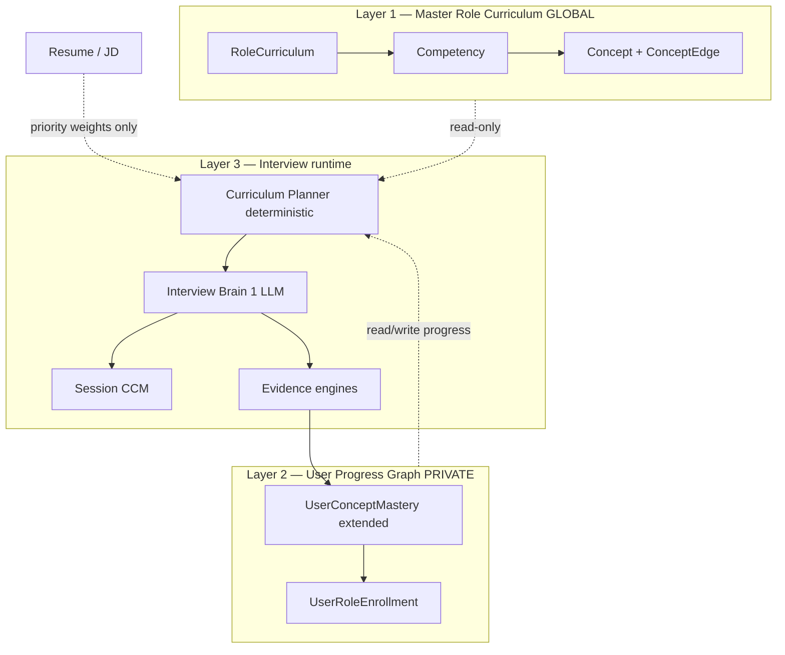

# 03 — Lifelong Role Curriculum (Architecture Proposal)

> **Status:** IMPLEMENTING — D1 done; D2 planner wired. Enable with `ROLE_CURRICULUM_V1=true` (+ `INTELLIGENCE_V2=true`).  
> **Product shift:** From one-off mock interviews → lifelong adaptive interview learning per target role.  
> **Principle:** Curriculum is global & stable. Progress is personal & evolving. Resume/JD personalize priority — they never replace the syllabus.  
> **Builds on:** Intelligence V2 + Interview Brain ([02](02-interview-brain-consolidation.md)).  
> **Do not rewrite** the project — evolve existing layers.

---

## 0. Decision summary (for approval)

| Question | Decision |
|----------|----------|
| Rewrite the app? | **No.** Evolve V2 + Brain. |
| Where does syllabus live? | **Master Role Curriculum** (global per role) |
| Where does learning live? | **User Progress Graph** (private) |
| What about session CCM? | **Keep** — session mind; progress graph is durable across months |
| Resume / JD? | Priority modifiers only; **never** syllabus |
| LLM generates curriculum? | **Bootstrap + propose only.** Curated seed for major roles; LLM fills gaps; slow admin/batch promotion |
| Auto-evolve from user answers? | **No.** Aggregated proposals only; validate before promote |
| First ship size? | ~40–80 concepts per major role (not 280 on day one) |
| Feature flag? | `ROLE_CURRICULUM_V1=true` (requires `INTELLIGENCE_V2`) |

### Explicit rejects

1. LLM-only living curriculum as sole source of truth.  
2. Frequency-based auto-promotion of concepts.  
3. Deleting Candidate Cognitive Model.  
4. Parallel second concept universe (extend `Concept` + role links).  
5. Resume-driven syllabus (current Brain bias must end).

---

## 1. Current architecture review

### What exists today

| Piece | Role today | Limitation |
|-------|------------|------------|
| Seeded `Concept` tree | Global knowledge catalog | Small, SWE-centric; not role-scoped |
| `ConceptEdge` | prerequisite / related / confused-with | Underused in question selection |
| `UserConceptMastery` | Per-user scores on concepts | No spaced review, coverage %, competency rollup |
| `CurriculumCache` | LLM topic lists keyed by role+mode+**JD** (+ resume in prompt) | Not a stable master syllabus; JD/resume leak into generation |
| Session `CognitiveModel` | In-interview dimensions/hypotheses | Session-scoped; not lifelong coverage |
| Interview Brain | 1 fused call per turn | Resume-preferring objectives |
| Resume Analyst | Seeds claims/hypotheses | Correct as personalization; wrong when it dominates Q selection |
| Knowledge / Progress UI | Tree + tracked mastery | No role coverage dashboard |

### Failure mode (observed)

Weak resume / no JD / domain switcher / Data Analyst / Android → Brain over-indexes on resume projects (or sparse claims) and **under-covers** role fundamentals that real interviewers ask.

### Product philosophy (target)

```
Duolingo continuity  +  LeetCode mastery tracking  +  FAANG interviewer judgment
```

Every session continues the candidate’s path toward mastering a **role**, not a random quiz.

---

## 2. What V2 components to reuse

| Keep / reuse | How |
|--------------|-----|
| `Concept`, `ConceptEdge` | Canonical concept IDs; edges for navigation |
| `UserConceptMastery` | Extend → User Progress Graph |
| Interview Brain (`INTELLIGENCE_BRAIN`) | Still 1 LLM call; add curriculum planner inputs + resume cap |
| Evidence / Hypothesis / Misconception engines | Feed progress updates |
| Session CCM | Unchanged role: this interview’s cognitive state |
| Resume Analyst | Personalization only (claims to verify, capped) |
| Report Writer / Study Plan | Consume coverage gaps |
| Knowledge UI | Become role progress + concept browser |
| Feature flags | Additive `ROLE_CURRICULUM_V1` |

| Replace / demote | How |
|------------------|-----|
| `CurriculumCache` as syllabus | Become **legacy fallback**; new `RoleCurriculum` is source of truth |
| Resume-first Brain open prompt | Cap resume; prefer untested/weak/due curriculum |

---

## 3. Three-layer architecture



**Hard rule:** Interviews never write Layer 1. They only update Layer 2 (+ session CCM).

---

## 4. Master Role Curriculum schema

### Models (additive)

```prisma
model RoleCurriculum {
  id              String   @id @default(uuid())
  roleSlug        String   @unique   // e.g. backend-engineer, data-analyst
  displayName     String             // Backend Engineer
  version         Int      @default(1)
  status          String   @default("active") // draft|active|deprecated
  summary         String   @default("")
  source          String   @default("seed")   // seed|llm-bootstrap|admin
  competencies    RoleCompetency[]
  enrollments     UserRoleEnrollment[]
  createdAt       DateTime @default(now())
  updatedAt       DateTime @updatedAt
}

model RoleCompetency {
  id                String   @id @default(uuid())
  curriculumId      String
  curriculum        RoleCurriculum @relation(...)
  slug              String           // authentication
  name              String
  description       String   @default("")
  importance        Float    @default(0.5)  // 0-1 interview weight
  coverageTarget    Float    @default(0.8)  // fraction of concepts to "competent+"
  sortOrder         Int      @default(0)
  concepts          RoleCompetencyConcept[]
  @@unique([curriculumId, slug])
}

model RoleCompetencyConcept {
  id              String   @id @default(uuid())
  competencyId    String
  competency      RoleCompetency @relation(...)
  conceptId       String
  concept         Concept @relation(...)
  difficultyBand  String   @default("medium") // easy|medium|hard entry point
  sortOrder       Int      @default(0)
  isCore          Boolean  @default(true)
  @@unique([competencyId, conceptId])
}

model CurriculumProposal {
  id           String   @id @default(uuid())
  roleSlug     String
  proposalType String   // add-concept|merge|deprecate|new-competency
  payload      Json
  status       String   @default("pending") // pending|promoted|rejected
  evidenceNote String   @default("")
  createdAt    DateTime @default(now())
}
```

### Concept enrichment (optional additive fields on `Concept`)

- Keep existing tree; add optional `importanceDefault`, `estimatedMinutes` later if needed.  
- Relationships stay on `ConceptEdge` (`prerequisite`, `related`, `commonly-confused-with`).

### Curriculum content shape (logical)

```
Role: Backend Engineer
  Competency: Authentication (importance 0.9)
    Concepts: sessions, jwt, refresh-tokens, oauth, oidc
  Competency: Database (importance 0.85)
    Concepts: joins, transactions, indexes, normalization
  ...
```

### Generation policy

| Event | Action |
|-------|--------|
| Role first needed & no row | Load **seed** if present; else LLM **bootstrap** → `status=draft` until promoted/`active` for known roles |
| Every interview | **Read only** |
| Admin refresh / batch job | Propose diffs → `CurriculumProposal` → LLM validate Promote/Reject/Merge → bump `version` |
| Single user struggle | **Never** mutate curriculum |

### Initial seeded roles (v1)

1. Backend Engineer  
2. Frontend Engineer  
3. Full-Stack / MERN  
4. Android Developer  
5. Data Analyst  
6. (stretch) DevOps, QA  

~40–80 concepts each via competencies linking into shared `Concept` rows (create missing slugs in seed).

---

## 5. User Progress Graph schema

### Extend `UserConceptMastery`

```prisma
// Additive fields on UserConceptMastery
status           // not_started|learning|weak|competent|strong|mastered|needs_review
difficultyReached String?  // easy|medium|hard
timesAsked       Int       // alias/clarify vs attempts
evidenceCount    Int
lastEvidenceAt   DateTime?
nextReviewAt     DateTime?
reviewIntervalDays Float?  // spaced repetition
misconceptionNotes String[] 
```

Map legacy statuses: `weak|learning|strong|mastered` already used → keep; add `not_started`, `competent`, `needs_review`.

### Enrollment

```prisma
model UserRoleEnrollment {
  id             String   @id @default(uuid())
  userId         String
  user           User @relation(...)
  curriculumId   String
  curriculum     RoleCurriculum @relation(...)
  isPrimary      Boolean  @default(true)
  coveragePct    Float    @default(0)
  velocity       String   @default("unknown") // improving|flat|declining
  estimatedSessionsRemaining Int?
  startedAt      DateTime @default(now())
  updatedAt      DateTime @updatedAt
  @@unique([userId, curriculumId])
}
```

### Rules

- New curriculum concept → users get progress implicitly as `not_started` (no row until first touch, or lazy default in API).  
- Interviews update **only** mastery + enrollment aggregates.  
- Never lose history on curriculum version bump (concepts keyed by stable slug/id).

---

## 6. Interview Planner (deterministic)

New module: `server/src/intelligence/curriculumPlanner.js`

### Inputs

- Active `RoleCurriculum` for `user.targetRole` (normalized slug)  
- User progress for those concept IDs  
- Session: mode, difficulty, practicePack, coveredTopics, plannedCount, turn index  
- Resume claims / open hypotheses (capped)  
- Optional JD extract (priority boosts only)  
- ConceptEdge prerequisite gaps  

### Output (session objectives)

```json
{
  "objectives": [
    {
      "type": "introduce|strengthen|review|verify-resume|probe-prerequisite|stretch",
      "conceptSlug": "jwt",
      "competencySlug": "authentication",
      "difficulty": "easy|medium|hard",
      "reason": "untested core concept"
    }
  ],
  "resumeBudgetRemaining": 2,
  "coverageBefore": 0.12,
  "priorityQueue": ["jwt", "transactions", "redis-ttl"]
}
```

### Selection priority (locked)

1. Concepts **due for review** (`nextReviewAt <= now`)  
2. **Weak** / `needs_review` / low confidence  
3. **Prerequisite gaps** before dependents  
4. **Untested core** (high importance, `not_started`)  
5. **JD boosts** (reorder only)  
6. **Resume verification** (hard cap, e.g. ≤25–30% of planned questions)  
7. **Stretch neighbors** when concept is strong/mastered  

### Practice pack mapping

| Pack | Planner bias |
|------|----------------|
| `fundamentals` | Untested + weak core only; resume budget ≈ 0–1 |
| `weak_topics` | Weak / needs_review |
| `mixed` | Full priority stack with resume cap |
| `behavioral_star` | Behavioral competency subset |
| `tricks` | Edge/hard band on known concepts |

Planner is **deterministic** (no LLM). Brain receives objectives and must satisfy them in `directorDecision` / `interviewPlan` / `nextQuestion`.

---

## 7. Interview Brain integration

### Context Builder additions

```
roleCurriculumBrief: { role, version, topCompetencies }
progressBrief: { coveragePct, weak[], dueReview[], untestedCore[] }
sessionObjectives: from Planner
resumeBudget: { used, max }
jdPrioritySlugs: []  // boosts only
```

### Prompt hard rules (add)

- Curriculum is the syllabus. Resume is personalization.  
- Prefer `sessionObjectives` unless answer quality forces a follow-up on the same concept.  
- Do not exceed resume budget.  
- When strengthening a strong concept, go **deeper** (harder band / neighbor), not skip.  
- When weak, move to **prerequisite** concepts.

### Still one LLM call

Internal stages unchanged + **User Progress Update proposals** in JSON:

```json
"progressUpdates": [
  {
    "conceptSlug": "jwt",
    "outcome": "correct|partial|incorrect",
    "difficulty": "medium",
    "statusHint": "learning|weak|competent",
    "confidenceDelta": 0.1
  }
]
```

Server applies updates with clamps + SR interval math (deterministic) — **do not trust LLM for nextReviewAt alone**; use SM-2-lite or fixed ladder.

### Open mode (first question)

Planner runs first → Brain open uses objective #1 (usually untested core or due review), **not** “prefer high-priority resume claim.”

---

## 8. Migration from Candidate Cognitive Model

| Concern | Approach |
|---------|----------|
| CCM session dimensions | Keep as-is |
| CCM `concepts[]` JSON | Mirror into progress graph on evidence apply; CCM remains session snapshot |
| Hypotheses / resume claims | Still session entities; feed Planner as resume queue |
| Old `CurriculumCache` | Fallback when `RoleCurriculum` missing for exotic roles |
| `User.weakTopics` string arrays | Derive from progress graph; keep arrays synced for V1 UI |
| Existing mastery rows | Backfill `nextReviewAt` null; map status enums |

**No data loss path:** additive migrations only.

---

## 9. Backward compatibility

| Mode | Behavior |
|------|----------|
| `ROLE_CURRICULUM_V1=false` | Current V2/Brain behavior |
| `true` + role has curriculum | Planner + Brain curriculum context |
| `true` + unknown role | LLM bootstrap draft **or** fallback `CurriculumCache` + warn |
| HTTP APIs | Additive fields on intelligence payloads / new `/me/role-progress` |
| Client | Progress dashboard section; Knowledge can filter by enrolled role |

Legacy columns on `Question` / `Session` unchanged.

---

## 10. Implementation roadmap

| Phase | Deliverable | Risk |
|-------|-------------|------|
| **D0** | Approve this doc | — |
| **D1** | Prisma models + migration; seed 3–5 roles | Medium |
| **D2** | `curriculumPlanner.js` + unit tests for priority order | Low |
| **D3** | Context Builder + Brain prompt rules (resume cap) | Medium |
| **D4** | Apply `progressUpdates` + SR intervals on answer | Medium |
| **D5** | `GET /me/role-progress` + Progress UI coverage | Low |
| **D6** | Enrollment on targetRole change; lazy not_started | Low |
| **D7** | Deprecate resume-first open prompt; A/B fixtures | Quality gate |
| **D8** | CurriculumProposal + admin refresh (optional) | Later |
| **D9** | Default flag on after quality gate | — |

### Success criteria

- No-resume Android/Data Analyst user gets **role fundamentals** in session 1.  
- Project-heavy MERN resume still sees ≤ ~30% resume probes in Mixed pack.  
- Coverage % increases across sessions for enrolled role.  
- Master curriculum unchanged by a single interview.  
- Brain remains **1 call** per answer turn.  
- V2 tables/UI keep working.

### Estimated effort

- D1–D5: ~1–1.5 weeks focused  
- D6–D7: ~2–3 days  
- D8: backlog  

---

## Dashboard (target UX)

```
Backend Engineer
Coverage 74%
Authentication  Strong
Database        Learning
Caching         Weak
Networking      Not started
Est. interviews remaining  18
Velocity  Improving
```

Data from `UserRoleEnrollment` + rollups over competency concepts.

---

## Relationship to Interview Brain (02)

- [02](02-interview-brain-consolidation.md) = **how** we call the model (orchestration cost).  
- **This doc** = **what** we teach across a lifetime (curriculum product).  

Ship Brain first (or together); curriculum planner makes Brain useful for every role without hand-adding topics like “React reconciliation” one by one.

---

## Open questions (resolve at approval)

1. Normalize `targetRole` free text → `roleSlug` (alias map vs LLM classify once)?  
2. Multi-role enrollments (primary + secondary) in v1 or later?  
3. Free plan: cap enrolled roles to 1?

**Recommendation:** alias map for top roles + fallback classifier; single primary enrollment in v1.
