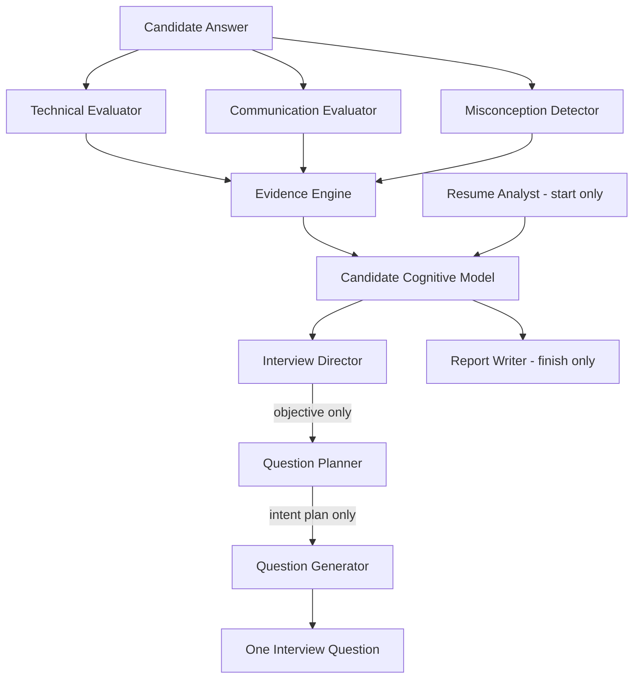

# 02 — Architecture Overview

> How V2 layers a reasoning brain on top of the existing Express + Prisma + Groq stack without touching the transport, database engine, or voice pipeline.

## Layered view

```
+-------------------------------------------------------------+
|  Presentation (unchanged): React + Vite screens             |
+-------------------------------------------------------------+
|  Transport (unchanged): Express routes                      |
|    /session/start   /session/:id/answer   /session/:id/finish|
+-------------------------------------------------------------+
|  V2 REASONING LAYER (new)                                   |
|    Orchestrator  ->  Specialist agents  ->  Cognitive Model |
|    (schedules who runs, merges evidence, applies fallback)  |
+-------------------------------------------------------------+
|  Providers (unchanged): Groq LLM, Whisper STT, Orpheus TTS  |
+-------------------------------------------------------------+
|  Persistence (extended additively): PostgreSQL + Prisma     |
|    existing models + new CCM / Hypothesis / Evidence tables |
+-------------------------------------------------------------+
```

The reasoning layer is the only new box. It sits between the route handlers and the LLM provider. Routes call the orchestrator instead of calling `buildInterviewerMessages`/`buildEvaluatorMessages` directly; the orchestrator internally still uses those V1 builders as a fallback.

## Data flow (one answer turn)



The flow is deliberately one-directional: evidence flows *up* into the model, decisions flow *down* into a question. No agent reads another agent's private prose; they communicate only through structured objects persisted on the cognitive model.

## Why the Director is not the Generator

This separation is the core architectural bet, so it is stated explicitly:

| Concern | Interview Director | Question Generator |
|---|---|---|
| Question it answers | "What should this question accomplish?" | "What words do we say?" |
| Input | full cognitive model, hypotheses, uncertainty | one question plan |
| Output | an objective (strategy), not prose | one natural-language question |
| Reasoning depth | high (chooses among competing goals) | low (phrasing + tone + language) |
| Failure impact | picks a suboptimal goal | awkward wording |

Blending them (as V1 does inside one prompt) means the model that writes friendly prose is also silently deciding strategy, and the two objectives compete inside a single generation. Splitting them makes strategy **inspectable and testable** (we can log/replay the objective) and lets the cheap prose model stay cheap. The Planner sits between them to translate a fuzzy objective ("reduce uncertainty on caching") into a concrete spec (intent, topic, target concept, difficulty, verification goal) the Generator can render.

Hard rules (repeated across docs):

- Director never writes question text.
- Generator never chooses strategy or topic.
- Technical Evaluator never scores communication.
- Communication Evaluator never scores knowledge.

## LLM-call budget philosophy

Intelligence must not mean "call every agent every turn." Cost and latency are first-class design constraints. The budget:

| Agent | Runs | Rationale |
|---|---|---|
| Resume Analyst | once at start (and if resume changes) | resume is static within a session |
| Technical Evaluator | every answered question | core knowledge signal |
| Communication Evaluator | every answered question | core delivery signal |
| Misconception Detector | conditionally: when technical score is mid/low or concepts partial/incorrect exist | expensive; only run when a misconception is plausible |
| Interview Director | every turn (small, structured JSON) | cheap; this is the "thinking" |
| Question Planner | every turn (can be merged with Director call) | translates objective |
| Question Generator | every turn | produces the actual question |
| Report Writer | finish only | one narrative per session |

Baseline: ~3-4 LLM calls per turn (2 evaluators + director/planner + generator), matching V1's ~2 calls plus the reasoning premium, with the Misconception Detector gated. This keeps quality high without linear cost blow-up. Exact scheduling and skip conditions are in [09](09-orchestration-pipeline.md).

## Graceful degradation

Every V2 stage has a defined fallback so a provider error never breaks an interview:

- Evaluators fail → use V1 `buildEvaluatorMessages` single-call result.
- Director/Planner fail → fall back to V1 `questionIndex % intents.length` intent selection.
- Cognitive model unavailable → fall back to `Session.memory` blob.
- Report Writer fails → fall back to V1 `buildVerdictMessages`.

Degradation is logged as evidence-quality metadata, not hidden. See [09](09-orchestration-pipeline.md) for the try/fallback ordering.

## Where each concept is elaborated

- Cognitive model internals → [03](03-candidate-cognitive-model.md)
- Agent I/O and never-do rules → [04](04-agents-catalog.md)
- Hypotheses / evidence / certainty → [05](05-hypothesis-and-evidence.md)
- Graph edges → [06](06-knowledge-graph-v2.md)
- Prompt + schema contracts → [07](07-prompts-and-json-schemas.md)
- DB/API changes → [08](08-database-and-apis.md)
- Pipeline scheduling → [09](09-orchestration-pipeline.md)
